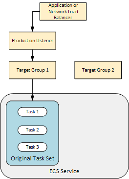
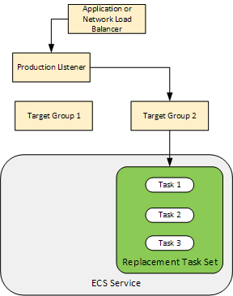

# How ECS deployments types works with Terraform?

There are three types of deployment, [docs](https://docs.aws.amazon.com/AmazonECS/latest/developerguide/deployment-types.html):

- **External**: it uses a third-party deployment controller, out of scope;
- **Rolling Update**: it uses ECS itself;
- **Blue Green**: it uses Code Deploy to perform the deployment;

## Rolling Update

Making it short, ECS will replace running tasks with new tasks. It can be controller using two parameters:

- **minimumHealthyPercent**: the lower bound of instances that must be running during deployment, rounded up;
- **maximumPercent**: the upper bound of instances that should be running during deployment, rounded down;

If minimumHealthyPercent is 50%, maximumPercent is 150% and there are 5 instances running, 3 (5 * 0.5, rounded up) instances is the lower bound and 7 (5 * 1.5, rounded down) instances is the upper bound. I did an experiment and this is what I saw:

| New Instances Running | New Instances Deprovisioning | Old Instances Running | Old Instances Provisioning |
| :-------------------: | :--------------------------: | :-------------------: | :------------------------: |
|           5           |              0               |           -           |             -              |
|           5           |              0               |           -           |             2              |
|           5           |              0               |           2           |             0              |
|           3           |              2               |           2           |             0              |
|           3           |              0               |           2           |             2              |
|           3           |              0               |           4           |             0              |
|           1           |              2               |           4           |             0              |
|           1           |              0               |           4           |             1              |
|           1           |              0               |           5           |             0              |
|           0           |              1               |           5           |             0              |
|           0           |              0               |           5           |             0              |

## Blue Green

Code Deploy shifts the traffic between Blue and Green ELB Target Groups. Wow this traffic occurs can be controller with these configurations:

- **Linear**: CodeDeployDefault.ECSLinear10PercentEvery1Minutes or CodeDeployDefault.ECSLinear10PercentEvery1Minutes;
- **Canary**: CodeDeployDefault.ECSCanary10percent5Minutes or CodeDeployDefault.ECSCanary10percent15Minutes;
- **All at once**: CodeDeployDefault.ECSAllAtOnce;

These configurations are self descriptive.

> When using NLB, only *CodeDeployDefault.ECSAllAtOnce* is supported!

There are very good images at [AWS Docs](https://docs.aws.amazon.com/codedeploy/latest/userguide/tutorial-ecs-deployment.html) explaining that this is the initial state:

And this is the final state:

Basically, Code Deploys creates a new ECS Task Set (a collection os ECS tasks!), attach it to the Target Group 2 and shifts traffic from Target Group 1 to Target Group 2. At this time, there are two ECS Task Sets. After shifted all trafic, it kills the old ECS Task Task. 

# How it really works?

I've created a simple application and a simple platform, so you will find these main directories:

- **platform**: has Terraform code that deploys ECS Cluster, ELB etc. It will deploy the platform where app wil run.
- **node-app**: has a `src` directory with the simple Node application and `infra` directory with Terraform code that deploys ECS Service, Code Deploy etc.
- **.github**: has Github Actions code that deploys all these items to an AWS account;

I recommend to see every file because I added comments that shows the mistakes I've made.
