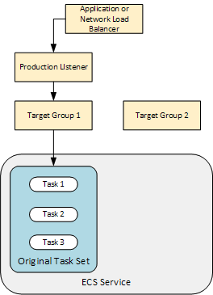
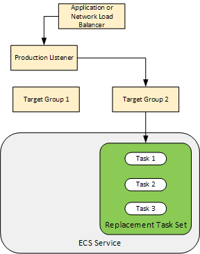
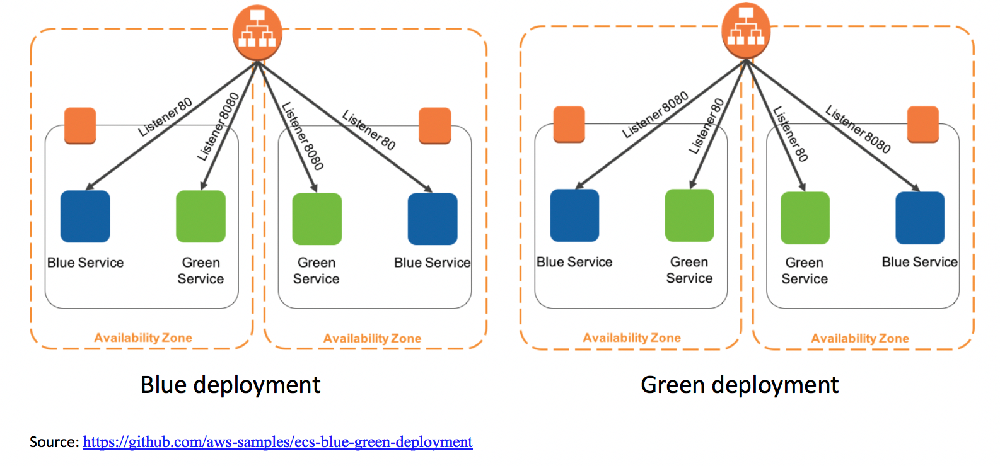

<!-- omit from toc -->
# Studies about ECS deployment types using Terraform

<!-- omit from toc -->
## Index

- [1. Deployment types](#1-deployment-types)
  - [1.1. Rolling Update](#11-rolling-update)
  - [1.2. Blue Green](#12-blue-green)
- [2. How it really works?](#2-how-it-really-works)

## 1. Deployment types

There are three types of deployment, [docs](https://docs.aws.amazon.com/AmazonECS/latest/developerguide/deployment-types.html):

- **External**: it uses a third-party deployment controller, out of scope; [docs](https://docs.aws.amazon.com/AmazonECS/latest/developerguide/deployment-type-external.html)
- **Rolling Update**: it uses ECS itself; [docs](https://docs.aws.amazon.com/AmazonECS/latest/developerguide/deployment-type-ecs.html)
- **Blue Green**: it uses Code Deploy; [docs](https://docs.aws.amazon.com/AmazonECS/latest/developerguide/deployment-type-bluegreen.html)

### 1.1. Rolling Update

With Rolling Update, ECS will replace running tasks with new tasks and it can be controlled with these parameters:

- **minimumHealthyPercent**: the lower bound of instances that must be running during deployment, rounded up;
- **maximumPercent**: the upper bound of instances that should be running during deployment, rounded down;

If *minimumHealthyPercent* is 50%, *maximumPercent* is 150% and there are 5 instances running, 3 (5 * 0.5, rounded up) instances is the lower bound and 7 (5 * 1.5, rounded down) instances is the upper bound. I did the experiment and these are the results:

| Old Instances Running | Old Instances Deprovisioning | New Instances Running | New Instances Provisioning |
| :-------------------: | :--------------------------: | :-------------------: | :------------------------: |
|           5           |              0               |           -           |             -              |
|           3           |              2               |           -           |             2              |
|           1           |              2               |           2           |             2              |
|           0           |              1               |           4           |             1              |
|           0           |              0               |           5           |             0              |

> If minimumHealthyPercent and maximumPercent combinations makes deployment impossible, it will throw an error!

### 1.2. Blue Green

With Blue Green, Code Deploy shifts traffic between Blue and Green ELB Target Groups and it can be controlled with these configurations:

- **Linear**: CodeDeployDefault.ECSLinear10PercentEvery1Minutes or CodeDeployDefault.ECSLinear10PercentEvery1Minutes;
- **Canary**: CodeDeployDefault.ECSCanary10percent5Minutes or CodeDeployDefault.ECSCanary10percent15Minutes;
- **All at once**: CodeDeployDefault.ECSAllAtOnce;

> When using NLB, only *CodeDeployDefault.ECSAllAtOnce* is supported!

There are very good images at [AWS Docs](https://docs.aws.amazon.com/codedeploy/latest/userguide/tutorial-ecs-deployment.html) explaining that this is the initial state:

And this is the final state:

Basically, Code Deploys creates a new ECS Task Set (a collection os ECS tasks!), attach it to the Target Group 2 and shifts traffic from Target Group 1 to Target Group 2. At this time, there are two ECS Task Sets. After shifting all traffic, it destroys the old ECS Task Set after 5 minutes.

We can add a Test Listener and perform tests using a Lambda to stop deployment on failure using a custom logic:

## 2. How it really works?

I've created a simple application and a simple platform to study it, so you will find these main directories:

- **platform**: has Terraform code that deploys shared resources like ECS Cluster, ELB etc needed by on or more apps;
- **apps/node-app**: has a `src` directory with the *node* application and `infra` directory with Terraform code that deploys ECS Service, Code Deploy etc needed only by the app;
- **apps/spring-app**: it's the same *node* app, but written with *Spring* and *Kotlin*. I've created it to test if Code Deploy can work with multiple rules inside a ALB Listener. It can!
- **.github**: has Github Actions code that deploys all these items to an AWS account;

I recommend to see every file because I added comments that shows the mistakes I've made.
